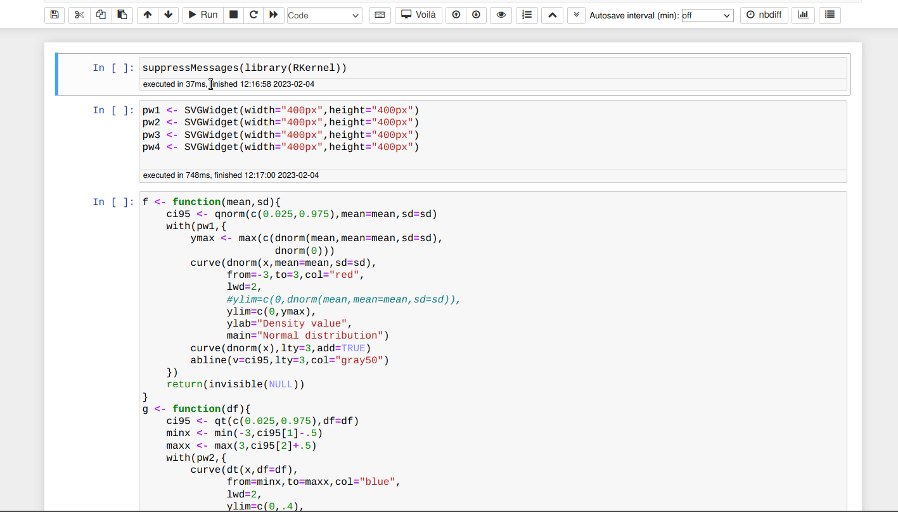

# RKernel

This is a re-creation from scratch of an [*R*](http://www.r-project.org) kernel
for [*Jupyter*](http://juypter.org).



To install run the following lines in *R*:

```{r}
devtools::install_github("melff/RKernel/pkg")
RKernel::installspec()
```
For dynamic help you also need to install the python package [jupyter-server-proxy](https://pypi.org/project/jupyter-server-proxy/).

This kernel differs from the already existing [*IRKernel*](http://irkernel.github.io) by:

  - Users can decide whether objects of certain classes are output via the 
    "stdout" stream - which allows using any dedicated `print()`-methods
    or via rich HTML/LaTeX output. By default the "stdout" stream is used 
    for most classes of objects. Classes can be designated for rich output 
    by calling `add_displayed_classes("some class")`. For individual objects,
    rich output can be requested using `display(some.object)`.
  - Users can decide wether an error or calling `stop()` leads to the termination
    of a notebook run or whether the succeeding notebook cells will be run.
    (This may be useful for teaching with notebooks.) Whether an error of `stop()` 
    leads to an notebook abort can be controlled by the option 
    `rkernel_stop_on_error`. 
  - Error and warning messages appear via the `stderr` stream, ordinary messages
    (created by `message()`) appear via the `stdout` stream. Consequently,
    "ordinary" messages (e.g. that appear while a package is loaded via
    `library()`) are less obtrusive, while error messages clearly stand out. 
  - Graphics can be "updated", so that e.g. `curve(gamma(x),add=TRUE)` 
    works as expected even if the 
    plot to which the curve is added has been created by code in a previous cell. 
  - It is based on the [*R6*](https://cran.r-project.org/package=R6) package
    instead of S4 reference classes.
  - Links in help pages work. To this purpose, help pages are not paged, but included
    into the notebook. This also allows to show several help pages in the notebook.
    Also `help.start()` now works. HTML help is shown using [jupyter-server-proxy](https://pypi.org/project/jupyter-server-proxy/)
  - The polling loop allows for providing services e.g. with the "htmluv"
    package.
  - It is possible to make use of the Widgets infrastructure provided by
    [*ipywidgets*](https://ipywidgets.readthedocs.io) to constructed interactive
    user interfaces. These can be used with jupyter notebooks, JupyterLab and
    [*voilà*](https://voila.readthedocs.io). *ipywidgets* are supported up to 
    version 8.0.
  - [HTML widgets](https://cran.r-project.org/package=htmlwidgets) generally
    work. However, *some* htmlwidgets (notably those created with
    [*plotly*](https://plotly.com/r/)) displayed with the setting
    `options(htmlwidgets_embed=TRUE)` however to not appear if the notebook is 
    opened in Google Chrome. 
    
  - There is also a support for virtual table display (based on the ipywidget
    infrastructure).
    

   
    
Some demonstration notebooks can be found [here](https://tmphub.elff.eu/user-redirect/).
    
A widget demonstration can be found [here](https://tmphub.elff.eu/user-redirect/voila/render/RKernel-demo-interact-linear-regression.ipynb).
    
TODO:

  - [x] Add documentation
  - [x] Make HTML help work on servers
  - [ ] Add example notebooks
  - [x] Make HTML widgets work more generally
